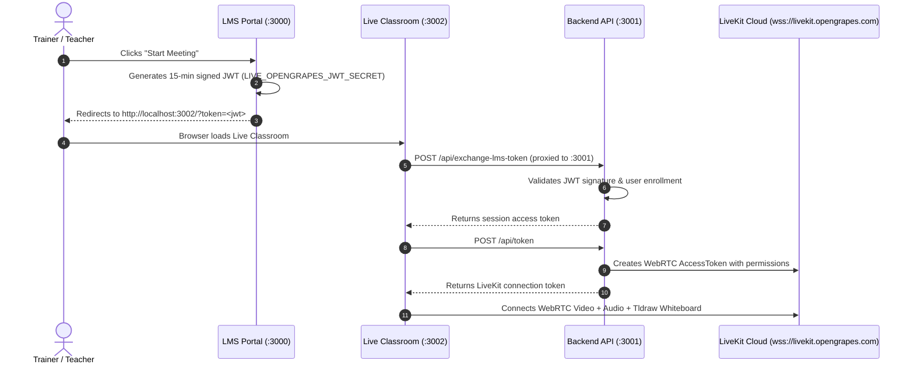

# 🍇 Capacity Connect — SIH 2026 (Problem Statement 26075)
> **Comprehensive Capacity Building & Training Management LMS Platform**

Capacity Connect is an enterprise-grade capacity building, trainer competency mapping, and live interactive classroom ecosystem developed for **Smart India Hackathon (SIH 2026, PS 26075)**.

---

## 🏛️ Monorepo Architecture & Port Mapping

This monorepo is partitioned into three decoupled workspaces so developers and AI agents can build features concurrently without merge conflicts:

| Workspace | Port | Purpose | Key Technologies |
| :--- | :--- | :--- | :--- |
| **[`lms/`](./lms)** | `3000` | Admin/Student Dashboards, Batches, Quizzes, Fees, Competency Mapping, Public CMS | Next.js 16 (App Router), React 19, Tailwind CSS, Auth.js, Pusher |
| **[`backend/`](./backend)** | `3001` | Modular REST Backend API, LiveKit Token Exchange, AI Doubt Solver, Prisma ORM | Node.js, Express, TypeScript, Prisma, LiveKit Server SDK, Gemini AI |
| **[`live/`](./live)** | `3002` | LiveKit WebRTC Video Classroom, Collaborative Tldraw Whiteboard, Speech Transcriber | Next.js 16, LiveKit Client SDK, Tldraw Sync, Silero VAD (ONNX) |

```
capacity-connect/
├── package.json              # Root npm workspaces orchestrator
├── README.md                 # Complete system guide & setup instructions
├── TEAM_WORKFLOW.md          # Git branching, dev assignments & conflict prevention
├── AGENTS.md                 # AI agent (Claude/Antigravity/Cursor) operating guidelines
├── CLAUDE.md                 # Claude code assistant instructions
│
├── backend/                  # Express + TypeScript Modular API (Port 3001)
│   ├── prisma/
│   │   └── schema.prisma     # SIH 2026 PostgreSQL Database Schema
│   └── src/
│       ├── app.ts            # Route pipeline & middleware registration
│       ├── index.ts          # Server entrypoint
│       ├── config/           # env.ts, db.ts (Prisma singleton), livekit.ts
│       ├── middleware/       # auth.ts (RBAC), rateLimiters.ts, errorHandler.ts
│       ├── routes/           # Domain-isolated API routes (auth, competency, certs, liveMeeting)
│       └── services/         # Decoupled business logic & AI providers
│
├── lms/                      # Next.js LMS Application (Port 3000)
│   ├── app/                  # Multi-role portals (/admin, /student, /join, /welcome)
│   ├── components/           # Admin/Student UI components
│   └── lib/                  # Auth, Session, Prisma, Pusher realtime sync
│
└── live/                     # Next.js Live Classroom Application (Port 3002)
    ├── app/                  # Classroom view (/ & /ended & /desktop-overlay)
    ├── components/           # VideoRoom, Whiteboard, LeftRail, Classroom Controls
    ├── hooks/                # Decoupled hooks (useDeviceDetection, useAudioTranscriber)
    └── public/vad/           # Silero VAD & ONNX WebAssembly models
```

---

## ⚡ Quick Start & Running the Codebase

### 1. Prerequisites
- **Node.js**: v18+ or v20+
- **PostgreSQL Database**: Neon DB, Supabase, or local PostgreSQL
- **LiveKit Cloud**: `wss://livekit.opengrapes.com` (No Docker required!)

### 2. Install Dependencies
Run from the root directory to install dependencies across all workspaces:
```bash
npm install
```

### 3. Generate Prisma Database Client
```bash
npm run prisma:generate
```

### 4. Configure Environment Variables
Copy `.env.example` files if not already populated:
```bash
# Backend (.env)
cp backend/.env.example backend/.env

# LMS (.env)
cp lms/.env.example lms/.env

# Live Classroom (.env.local)
cp live/.env.example live/.env.local
```

### 5. Launch All Services Concurrently
Run all three services simultaneously with unified colored terminal logging:
```bash
npm run dev:all
```

Or run individual services:
```bash
npm run dev:backend   # Express API (http://localhost:3001)
npm run dev:lms       # LMS Portal (http://localhost:3000)
npm run dev:live      # Live Classroom (http://localhost:3002)
```

---

## 🎥 Live Meeting Workflow (How LMS & Live Connect)



---

## 🛡️ How to Make Changes Without Merge Conflicts

To enable **4-5 human developers** and **AI assistants (Claude, Antigravity, Cursor, ChatGPT)** to work on this repository simultaneously without conflicts, follow these golden rules:

### 📁 1. Strict Domain-File Isolation Rule
- **Backend**: Never add business logic directly into `app.ts` or `index.ts`. Always create a new file in `backend/src/routes/<domain>.ts` and matching `backend/src/services/<domain>.service.ts`.
- **LMS**: Place each feature in its own subfolder under `lms/app/admin/<feature>/` or `lms/app/student/<feature>/`.
- **Live Classroom**: Extract stateful UI logic into `live/hooks/` and UI pieces into `live/components/classroom/`.

### 🌿 2. Git Branch Strategy
1. **Never commit directly to `main` or `dev`**.
2. Create dedicated feature branches:
   ```bash
   git checkout dev
   git pull origin dev
   git checkout -b feature/<your-name-or-agent>-<feature-description>
   ```
3. Example branch names:
   - `feature/claude-competency-radar-chart`
   - `feature/dev2-certificate-pdf-template`
   - `feature/dev4-whiteboard-pdf-upload`

### 🗄️ 3. Database Schema Changes Protocol
- Before modifying `backend/prisma/schema.prisma`, coordinate with the Backend Lead (**Dev 1**).
- Always add additive changes (new models/fields) rather than renaming active columns.
- Run `npm run prisma:generate` after editing the schema.

### 🤖 4. Guidelines for AI Assistants (Claude / LLMs)
When asking an AI agent to build a feature:
1. **Specify the exact workspace**: Tell the AI whether you are modifying `lms/`, `live/`, or `backend/`.
2. **Tell the AI to create new files**: Instruct the AI: *"Create a new service file under `src/services/` rather than modifying existing service files"*.
3. Refer the AI to [`AGENTS.md`](./AGENTS.md) and [`TEAM_WORKFLOW.md`](./TEAM_WORKFLOW.md).

---

## 📜 License
Developed for Smart India Hackathon (SIH 2026) — OpenGrapes Team.
