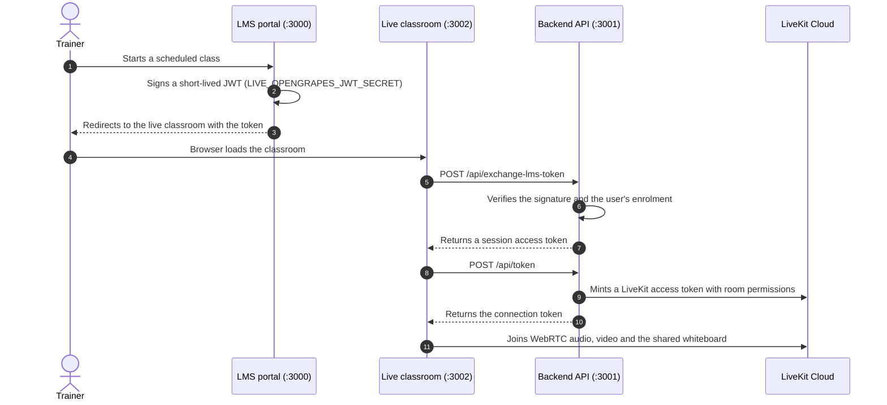

# Capacity Connect

**Smart India Hackathon 2026 — Problem Statement 26075**

Capacity Connect is a capacity-building and training-management platform for the Ministry of Earth Sciences (MoES) and the India Meteorological Department (IMD). It covers the full training lifecycle: trainee and trainer profiles, course enrolment, study material, timed assessments, competency mapping, verifiable certificates, course feedback, a public announcements portal, and a live WebRTC classroom with a collaborative whiteboard.

---

## Workspaces

The repository is an npm workspaces monorepo partitioned into three independently runnable applications, so several developers can work concurrently without contending for the same files.

| Workspace | Port | Responsibility | Key technologies |
| :--- | :--- | :--- | :--- |
| [`lms/`](./lms) | 3000 | Admin, trainer and trainee portals; courses, assessments, competency mapping, certificates, trainer library, announcements CMS, public verifier, MeghDoot AI assistant | Next.js 16 (App Router), React 19, Tailwind CSS v4, Prisma 7, Auth.js v5, Pusher |
| [`backend/`](./backend) | 3001 | Live-classroom token exchange, LiveKit access tokens, AI doubt solver | Node.js, Express, TypeScript, Prisma 6, LiveKit Server SDK, Gemini |
| [`live/`](./live) | 3002 | LiveKit WebRTC classroom, collaborative tldraw whiteboard, speech transcription | Next.js 16, LiveKit Client SDK, tldraw sync, Silero VAD (ONNX) |

The two Prisma workspaces use **separate databases**. The LMS owns the application data model; the backend database serves the live-classroom bridge only. See [Architecture notes](#architecture-notes).

### Repository layout

```
capacity-connect/
├── package.json              Root npm workspaces orchestrator
├── README.md                 This file
├── TEAM_WORKFLOW.md          Branching model and developer assignments
├── AGENTS.md                 Operating guidelines for AI coding agents
├── CLAUDE.md                 Claude Code assistant instructions
│
├── lms/                      Next.js LMS portal (port 3000)
│   ├── app/                  Route groups: /platform (admin), /admin (trainer),
│   │                         /student (trainee), /verify, /announcements, /api
│   ├── components/           UI primitives and feature components
│   ├── lib/                  Pure domain logic, Prisma wrappers, auth, session
│   │   └── __tests__/        Vitest unit tests for the pure modules
│   └── prisma/               Schema, migrations, and the MoES/IMD seed
│
├── backend/                  Express + TypeScript API (port 3001)
│   ├── prisma/schema.prisma  Backend database schema
│   └── src/
│       ├── app.ts            Middleware and router registration
│       ├── config/           Environment, Prisma singleton, LiveKit config
│       ├── middleware/       Authentication, rate limiting, error handling
│       ├── routes/           Domain-isolated routers
│       └── services/         Business logic and AI providers
│
└── live/                     Next.js live classroom (port 3002)
    ├── app/                  Classroom, ended, and desktop-overlay views
    ├── components/           Video room, whiteboard, classroom controls
    ├── hooks/                Device detection, audio transcription
    └── public/vad/           Silero VAD and ONNX WebAssembly models
```

---

## Getting started

### Prerequisites

- Node.js 20 or later
- PostgreSQL, either local or hosted (Neon, Supabase, or equivalent)
- A LiveKit endpoint. The team instance is `wss://livekit.opengrapes.com`; no local Docker is required.

### 1. Install dependencies

Run from the repository root to install every workspace:

```bash
npm install
```

The LMS `postinstall` hook generates its Prisma client automatically. The backend client is generated separately:

```bash
npm run prisma:generate     # generates the backend Prisma client only
```

### 2. Configure environment variables

Copy the example files and fill in your values:

```bash
cp lms/.env.example lms/.env
cp backend/.env.example backend/.env
```

The `live/` workspace needs no environment file for local development. It reads a single optional variable, `NEXT_PUBLIC_SYNC_WORKER_URL`, for the hosted whiteboard sync worker.

The variables that most often need attention:

| Workspace | Variable | Purpose |
| :--- | :--- | :--- |
| `lms/` | `DATABASE_URL` | Pooled Postgres connection string used at runtime |
| `lms/` | `DIRECT_URL` | Direct (non-pooled) connection string used by Prisma Migrate |
| `lms/` | `NEXTAUTH_URL`, `NEXTAUTH_SECRET` | Auth.js base URL and session signing secret |
| `lms/` | `GOOGLE_CLIENT_ID`, `GOOGLE_CLIENT_SECRET` | Google OAuth for trainee sign-in |
| `lms/` | `CERTIFICATE_SECRET` | HMAC-SHA256 secret for certificate verification hashes. Minimum 16 characters. Keep it stable, or previously issued certificates stop verifying. |
| `lms/` | `UPLOAD_DIR` | Directory for trainer-library uploads. Defaults to `./uploads`, which is gitignored. |
| `lms/` | `DEEPSEEK_API_KEY` | Optional. Enables the language model behind MeghDoot and the assessment generator. |
| `lms/` | `MEETING_PLATFORM_URL`, `MEETING_PLATFORM_API_URL` | Live classroom UI and API endpoints |
| `lms/`, `backend/` | `LIVE_OPENGRAPES_JWT_SECRET` | Shared signing secret for the live-classroom handoff. **Must be identical in both files.** |
| `backend/` | `DATABASE_URL` | Backend Postgres connection string, a different database from the LMS |
| `backend/` | `LIVEKIT_URL`, `LIVEKIT_API_KEY`, `LIVEKIT_API_SECRET` | LiveKit Cloud credentials |
| `backend/` | `GEMINI_API_KEY` | Optional. Enables OCR in the live-class doubt tab. |

### 3. Prepare the database

From `lms/`, apply migrations and load the demonstration dataset:

```bash
cd lms
npx prisma migrate deploy    # or: npm run db:migrate  (development)
npm run db:seed
```

The seed is destructive and idempotent. It clears application tables and rebuilds a complete MoES/IMD dataset: 15 users, four courses, 16 competencies, a 34-node knowledge graph, assessments with recorded attempts, certificates, announcements, and library items.

### 4. Run the services

All three concurrently, with per-workspace coloured logging:

```bash
npm run dev:all
```

Or individually:

```bash
npm run dev:lms       # http://localhost:3000
npm run dev:backend   # http://localhost:3001
npm run dev:live      # http://localhost:3002
```

Do not change these ports. The live-classroom handoff and CORS configuration depend on them.

---

## Demonstration credentials

Created by `npm run db:seed`. Bare usernames are a development convenience and are rejected when `NODE_ENV=production`.

| Role in the database | Portal label | Landing route | Sign-in |
| :--- | :--- | :--- | :--- |
| `SUPER_ADMIN` | Admin (MoES) | `/platform` | `admin` / `Admin@2026` |
| `ADMIN` | Trainer (IMD) | `/admin` | `trainer` / `1234` |
| `STUDENT` | Trainee | `/student` | `trainee` / `1234` |

Additional seeded accounts use their full email address with the password `trainer123` or `trainee123`, for example `trainer.nwp@imd.gov.in` and `trainee.radar@imd.gov.in`. The role enum values are retained from the platform's origins and mapped to ministry-facing labels in `lms/lib/roles.ts`.

The home page, `/announcements`, and `/verify` are public and require no session.

## Behaviour without a language-model key

Every AI feature degrades deterministically, so the platform is fully demonstrable offline. When `DEEPSEEK_API_KEY` is unset:

- **MeghDoot** answers from the knowledge graph alone, rendering the traversal paths and source citations that grounded the answer instead of prose from a model.
- **The assessment generator** draws from a curated offline question bank of operational meteorology items and labels the result accordingly in the review step.
- **The course recommender** and **competency mapping** are unaffected. Both are deterministic scoring functions with no model dependency.

---

## Live classroom handoff



---

## Architecture notes

**The LMS is the application.** All domain features are implemented inside `lms/` as Next.js Server Actions over the LMS database. Scoring, graph traversal, and certificate logic live as dependency-free modules in `lms/lib/` with unit tests, and thin Prisma wrappers supply their data.

**The backend serves the live classroom.** Its routers for profiles, competency, certificates, feedback, announcements, and analytics are historical and are deliberately not called by the LMS. Bridging them would require reconciling two user tables, two Prisma major versions, and two authentication systems for no functional gain, so the two valuable algorithms from that codebase, competency scoring and certificate signing, were ported into `lms/lib/` instead. Only the live-meeting endpoints are on the critical path. Treat the remaining routers as dormant, and do not build new features against them.

**Certificates are verifiable without an account.** Each certificate carries an HMAC-SHA256 hash over its number, recipient, course, and issue date. The public verifier at `/verify` recomputes that hash, so a tampered record is detected rather than trusted, and the check needs no session.

**File storage is local by design.** Trainer-library uploads are written to `UPLOAD_DIR` and streamed back through an authenticated route that enforces course access and supports range requests. Serverless hosts have no persistent disk; to deploy there, replace the single adapter in `lms/lib/storage.ts` with object storage. No caller changes are needed.

---

## Verification

Run from `lms/`:

```bash
npx tsc --noEmit         # type checking
npm run lint             # ESLint
npm run test             # Vitest unit tests
npm run build            # applies migrations, then builds
```

The backend and live workspaces build with `npm run build:backend` and `npm run build:live` from the repository root.

---

## Contributing

The following conventions keep several developers and AI agents productive in one repository.

### Isolate changes by domain

- **Backend**: never place business logic in `app.ts` or `index.ts`. Add `src/routes/<domain>.ts` with a matching `src/services/<domain>.service.ts`.
- **LMS**: give each feature its own folder under `app/platform/`, `app/admin/`, or `app/student/`, with a local `actions.ts`. Keep pure logic in `lib/` and cover it with tests.
- **Live classroom**: extract stateful logic into `live/hooks/` and presentation into `live/components/`.

Prefer additive changes. Adding a file is always safer than restructuring a shared one.

### Branching

Never commit directly to `main` or `dev`. Branch from `dev`:

```bash
git checkout dev
git pull origin dev
git checkout -b feature/<owner>-<short-description>
```

### Schema changes

Coordinate before editing either `schema.prisma`. Add new models and nullable fields rather than renaming or dropping active columns, since the LMS build runs `prisma migrate deploy`. Regenerate the client after any edit.

### Working with AI agents

State the target workspace explicitly, ask for new files rather than edits to shared ones, and point the agent at [`AGENTS.md`](./AGENTS.md) and [`TEAM_WORKFLOW.md`](./TEAM_WORKFLOW.md).

---

## License

MIT. Developed by Team OpenGrapes for Smart India Hackathon 2026.
