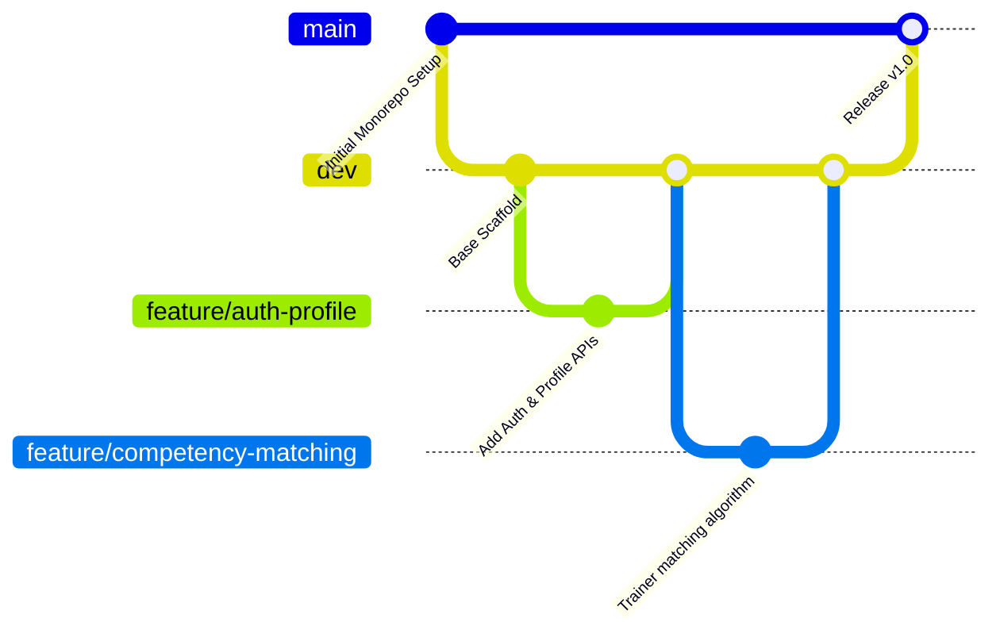

# 👥 SIH 2026 - Team Workflow & Developer Coordination Guide
**Problem Statement 26075**: Comprehensive Capacity Building & Training Management LMS Platform

---

## 🏗️ 1. Monorepo Architecture Overview

This monorepo is divided into three isolated domains so that all team members can work simultaneously without stepping on each other's code:

```
capacity-connect/
├── backend/    # Modular Node.js / Express / TypeScript API + Prisma ORM
├── lms/        # Next.js App: Dashboards, CMS, Competency Mapping, Assessments
└── live/       # Next.js App: LiveKit WebRTC Video Classroom, Whiteboard, Notes
```

---

## 🌿 2. Git Branching Strategy

We follow a strict **Trunk-Based Feature Branch** workflow to avoid merge conflicts:



### Branch Naming Conventions:
- **`main`**: Production-ready code (Protected branch; do not push directly).
- **`dev`**: Integration branch for all tested feature branches.
- **`feature/<domain>-<short-description>`**:
  - Example: `feature/backend-competency-engine`
  - Example: `feature/lms-trainer-dashboard`
  - Example: `feature/live-whiteboard-sync`
  - Example: `feature/backend-certificate-crypto`
- **`fix/<issue-description>`**: Bug fixes (e.g., `fix/livekit-token-expiry`).

### Git Daily Routine:
1. Before starting work:
   ```bash
   git checkout dev
   git pull origin dev
   git checkout -b feature/your-feature-name
   ```
2. While working, keep your branch updated:
   ```bash
   git fetch origin
   git rebase origin/dev
   ```
3. When ready for review:
   - Push your branch to GitHub: `git push origin feature/your-feature-name`
   - Open a Pull Request (PR) into **`dev`**.
   - Request review from at least 1 teammate before merging.

---

## 👨‍💻 3. Feature Allocation Matrix for 4-5 Developers

| Developer | Primary Role / Domain | Key Responsibilities & Files |
| :--- | :--- | :--- |
| **Dev 1 (Backend Lead)** | Auth, Profile, RBAC & Core API | • `backend/src/routes/auth.ts`, `backend/src/routes/profile.ts`<br>• `backend/src/services/auth.service.ts`<br>• Prisma migrations & User profile sync<br>• JWT authentication & Role-based middleware |
| **Dev 2 (Algorithmic & Analytics Lead)** | Competency Mapping & Admin Analytics | • `backend/src/routes/competency.ts`, `backend/src/routes/analytics.ts`<br>• `backend/src/services/competency.service.ts` (Trainer-to-Program scoring algorithm)<br>• Attendance & Completion rate metric aggregators<br>• `lms/` Admin Analytics visualization charts |
| **Dev 3 (Certifications & Public CMS Lead)** | Certificates, Feedbacks & Public CMS | • `backend/src/routes/certificates.ts`, `backend/src/routes/feedback.ts`<br>• `backend/src/routes/announcements.ts`<br>• SHA-256 Certificate verification logic & PDF templates<br>• Public portal announcements & Course feedback forms |
| **Dev 4 (Live Classroom & LiveKit Lead)** | WebRTC Live Sessions & Tldraw Whiteboard | • `backend/src/routes/livekit.ts` (Tokens & Webhooks)<br>• `live/` video grid & LiveKit cloud connection (`wss://livekit.opengrapes.com`)<br>• Real-time speech transcription & Tldraw whiteboard sync<br>• Meeting minutes & doubt logging during live sessions |
| **Dev 5 (LMS Frontend / UI Lead)** | Next.js Unified Dashboards & Portals | • `lms/` Multi-role Dashboards (Super Admin, Admin, Trainer, Trainee)<br>• Trainee skill progression UI & batch enrollments<br>• Program creation wizard & competency requirement selector<br>• Connecting frontend components to backend REST APIs |

---

## ⚡ 4. Local Development Setup

### Prerequisites:
- **Node.js**: v18+ or v20+
- **PostgreSQL Database**: Local or Cloud (e.g. Supabase / Neon / Local Postgres)
- **LiveKit Server**: Configured to `wss://livekit.opengrapes.com`

### Quick Start:
1. **Clone repository**:
   ```bash
   git clone https://github.com/manasrikhari/capacity-connect.git
   cd capacity-connect
   ```

2. **Install all dependencies**:
   ```bash
   npm install
   ```

3. **Configure Environment Variables**:
   - Copy `.env.example` in `backend/`, `lms/`, and `live/` to `.env`.
   - Update `DATABASE_URL` in `backend/.env`.

4. **Initialize Database**:
   ```bash
   npm run prisma:generate
   npm run prisma:migrate
   ```

5. **Run Applications**:
   - Run Backend API (Port 3001):
     ```bash
     npm run dev:backend
     ```
   - Run LMS Dashboard (Port 3000):
     ```bash
     npm run dev:lms
     ```
   - Run Live Classroom (Port 3002):
     ```bash
     npm run dev:live
     ```
   - Or run all services concurrently:
     ```bash
     npm run dev:all
     ```

---

## 🛡️ 5. Clean Code & Conflict Prevention Rules

1. **No Monoliths**: Never put new routes in a central file. Always create a dedicated file under `src/routes/` and its matching service in `src/services/`.
2. **Type Safety First**: All request/response payloads should have explicit TypeScript interfaces.
3. **Database Changes**: Always discuss Prisma schema modifications with **Dev 1** before modifying `backend/prisma/schema.prisma` to prevent migration conflicts.
4. **Environment Secrets**: Never commit `.env` files. Always update `.env.example` when adding a new environment variable.
